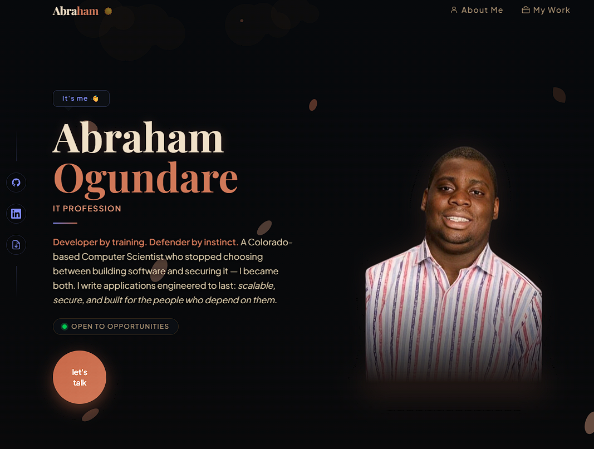
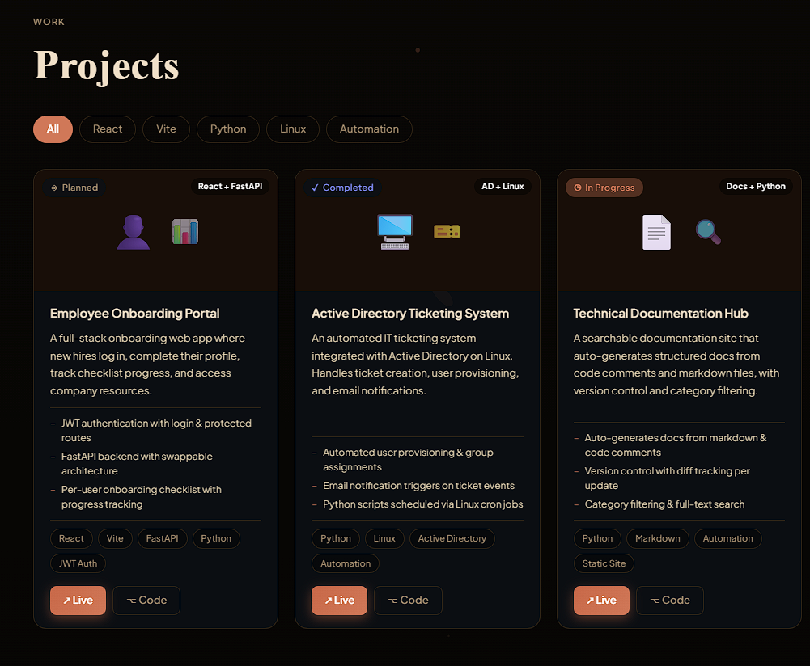

# Abraham Ogundare — Professional Portfolio

A personal portfolio website built to showcase my professional experience in IT and software development. Designed as my entry into the industry, this site reflects my background as a Computer Science graduate with a dedicated focus on IT infrastructure, cybersecurity, and modern web development.

**Live Site:** [aogundare.com](https://aogundare.com) *(Launching on Hostinger)*

---

## Tech Stack

| Technology            | Purpose                   |
|-----------------------|---------------------------|
| React                 | UI component architecture |
| Vite                  | Build tool and dev server |
| JavaScript            | Core language             |
| Tailwind CSS          | Utility-first styling     |
| Vitest                | Unit testing              |
| React Testing Library | Component testing         |

---

## About This Project

This portfolio serves as a single source of truth for my professional career — bridging my Computer Science degree with my hands-on IT experience. It is my first portfolio and was built entirely from the ground up, with a focus on clean code, accessibility, and maintainable architecture.

Every design and engineering decision made here reflects how I approach real-world problems: with intention, structure, and attention to detail.

---
## Preview 
    ### Desktop


### Projects


### Mobile


## Features

### Current
- **Animated Spring Canvas** — a custom HTML5 canvas background featuring falling petals, leaves, and pollen particles built entirely in vanilla JavaScript
- **Dynamic Theme System** — light and dark mode powered by a centralized design system; all colors, gradients, and shadows flow from a single source of truth
- **Seasonal Themes** — themes are automated by Mountain Time and can be manually toggled; current seasons supported: Spring and Fall; Winter and Summer in development
- **Projects Section** — filterable project cards with status badges (Planned, In Progress, Completed), tech stack tags, and live/code links
- **About Section** — timeline-based career history with categorized achievements and certifications
- **Contact Form** — Formspree-powered contact form with honeypot bot protection and client-side cooldown on CTA
- **Accessible by Design** — ARIA labels, keyboard navigation, `aria-pressed` filter states, and screen reader announcements throughout
- **Unit Tested** — 15 tests covering rendering, filtering, status badges, and accessibility using Vitest and React Testing Library

### Planned
- **Winter & Summer Seasonal Themes** — automated by Mountain Time zone with manual override
- **Blog / Articles Section** — a space to share technical writing, thoughts, and personal projects that reflect my mindset and interests
- **IT Portfolio** — a dedicated section for IT infrastructure, Active Directory, and cybersecurity projects
- **Software Portfolio** — a dedicated section for software and web development projects as they grow

---

## Project Structure

```
src/
  components/
    layout/       # Canvas background and layout shell
    sections/     # Hero, About, Projects, Footer
  hooks/          # Theme toggle logic
  constants/      # Contact information and app constants
  __tests__/      # Unit tests
  App.jsx
  main.jsx
```

---

## Running Locally

```bash
# Clone the repository
git clone https://github.com/aogundare/aogundare-portfolio.git

# Navigate into the project
cd aogundare-portfolio

# Install dependencies
npm install

# Start the development server
npm run dev
```

The site will be available at `http://localhost:5173`

---

## Running Tests

```bash
# Run all tests once
npm test -- --run

# Run in watch mode
npm test
```

---

## Deployment

This site is deployed via **Hostinger** at [aogundare.com](https://aogundare.com).

To build for production:
```bash
npm run build
```

---

## Security Considerations

Several security hardening measures were implemented post-build as part of an ongoing effort to ship responsibly:

- **Email obfuscation** — contact details are split and assembled at runtime to prevent bot scraping
- **Content Security Policy** — implemented in `index.html` to restrict resource loading to trusted domains only
- **Unpredictable asset paths** — resume and other public assets served via non-guessable paths
- **Formspree contact form** — replaces exposed mailto links; includes honeypot field for bot detection
- **Client-side cooldown** — CTA button throttled after click to prevent mailto abuse
- **Generic project structure** — repository structure documented at folder level only to limit attack surface

*Additional hardening planned before public launch — see High and Medium severity items in progress.*

---

## Skills Demonstrated

- **Languages:** JavaScript, Python, C++
- **Frameworks:** React, Vite, Tailwind CSS
- **Testing:** Vitest, React Testing Library
- **Concepts:** Accessible UI, Design Systems, Component Architecture, Canvas Animation, Unit Testing, Web Security

---

## Contact

**Abraham Ogundare**
- Portfolio: [aogundare.com](https://aogundare.com)
- GitHub: [github.com/aogundare](https://github.com/aogundare)
- Email: abeogundare@gmail.com

---

*© 2026 Abraham Ogundare. Built with intention.*
